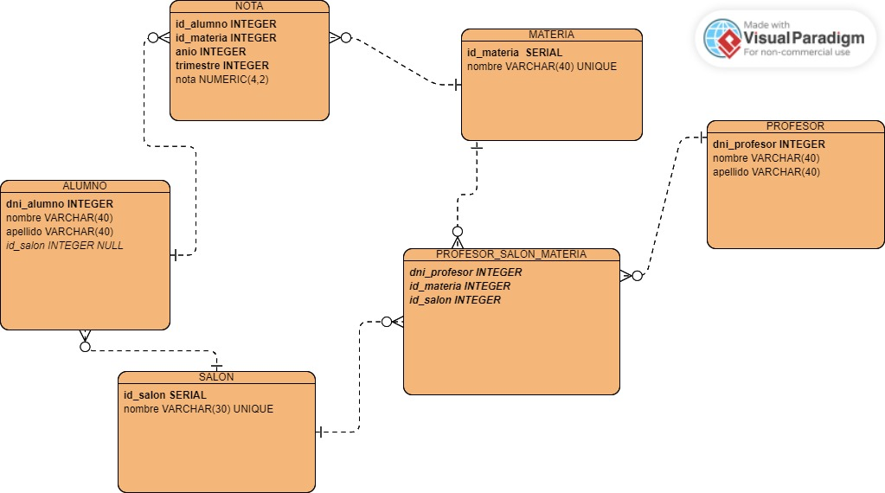

# API para una escuela/colegio pequeña

Permite gestionar un CRUD sobre los datos ingresados.

- Por cada salon, existen 0/N profesores, como maximo 1 profesor de una materia en especifico para cada salon.



IMPORTANTE: Todos estos endpoints estan en el archivo "APIEscuela.postman_collection.json" el cual puede ser abierto desde postman para utilizar la API

## ENDPOINTS
- [MATERIA](#materia)
- [SALON](#salon)
- [ALUMNO](#alumno)
- [NOTA](#nota)
- [PROFESOR](#profesor)
### MATERIA
- POST http://localhost:7000/api/v1/materia
  ```json
    {
      "nombre": "historia" 
    } 
  ```
- GET http://localhost:7000/api/v1/materia
- GET http://localhost:7000/api/v1/materia/:idMateria
- DELETE http://localhost:7000/api/v1/materia/:idMateria
- PUT http://localhost:7000/api/v1/materia/:idMateria
  ```json
    {
      "nombre": "historia" 
    } 
  ```
### SALON
- POST http://localhost:7000/api/v1/salon
  ```json
    {
      "salon": "verde" 
    } 
  ```
- GET http://localhost:7000/api/v1/salon
- GET http://localhost:7000/api/v1/salon/:idSalon
- DELETE http://localhost:7000/api/v1/salon/:idSalon
- PUT http://localhost:7000/api/v1/salon/:idSalon
  ```json
    {
      "nombre": "rojo" 
    } 
  ```
- GET http://localhost:7000/api/v1/salon/:idSalon/alumno
### ALUMNO
- POST http://localhost:7000/api/v1/alumno
  ```json
    {
      "dni": 40111222,
      "nombre": "Ramiro",
      "apellido": "Torres",
      "idSalon": 1
    } 
  ```
- GET http://localhost:7000/api/v1/alumno
- GET http://localhost:7000/api/v1/alumno/:dniAlumno
- DELETE http://localhost:7000/api/v1/alumno/:dniAlumno
- PUT http://localhost:7000/api/v1/alumno/:dniAlumno
  ```json
    {
      "dni": 40111222,
      "nombre": "Ramiro",
      "apellido": "Torres",
      "idSalon": 2
    } 
  ```
### NOTA
- POST http://localhost:7000/api/v1/nota
  ```json
    {
      "dniAlumno": 44500600,
      "idMateria": 1,
      "anio": 2024,
      "trimestre": 2,
      "nota": 7
    }
  ```
- GET http://localhost:7000/api/v1/nota
- GET http://localhost:7000/api/v1/nota/dniAlumno/:dniAlumno/idMateria/:idMateria/anio/:anio/trimestre/:trimestre
- DELETE http://localhost:7000/api/v1/nota/dniAlumno/:dniAlumno/idMateria/:idMateria/anio/:anio/trimestre/:trimestre
- PUT http://localhost:7000/api/v1/nota/dniAlumno/:dniAlumno/idMateria/:idMateria/anio/:anio/trimestre/:trimestre
  ```json
    {
      "dniAlumno": 44500600,
      "idMateria": 1,
      "anio": 2024,
      "trimestre": 2,
      "nota": 7
    } 
  ```
### PROFESOR
- POST http://localhost:7000/api/v1/profesor
  ```json
    {
      "dni": 20111222,
      "nombre": "Julian",
      "apellido": "Alvarez"
    } 
  ```
- GET http://localhost:7000/api/v1/profesor
- GET http://localhost:7000/api/v1/profesor/:dniProfesor
- DELETE http://localhost:7000/api/v1/profesor/:dniProfesor
- PUT http://localhost:7000/api/v1/profesor/:dniProfesor
  ```json
    {
      "dni": 20111222,
      "nombre": "Julian",
      "apellido": "Ortega"
    } 
  ```
- POST http://localhost:7000/api/v1/profesor/:dniProfesor/salon
  ```json
    {
      "idMateria": 1,
      "idSalon": 1
    } 
  ```
- DELETE http://localhost:7000/api/v1/profesor/:dniProfesor/salon/:idSalon/materia/:idMateria
  
